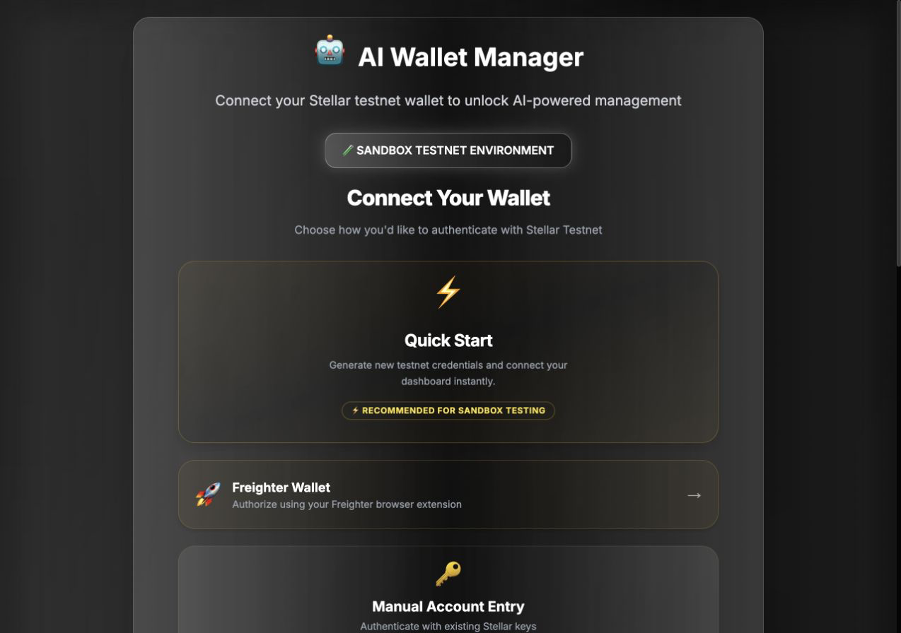
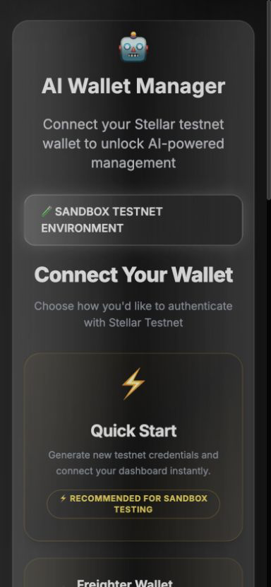
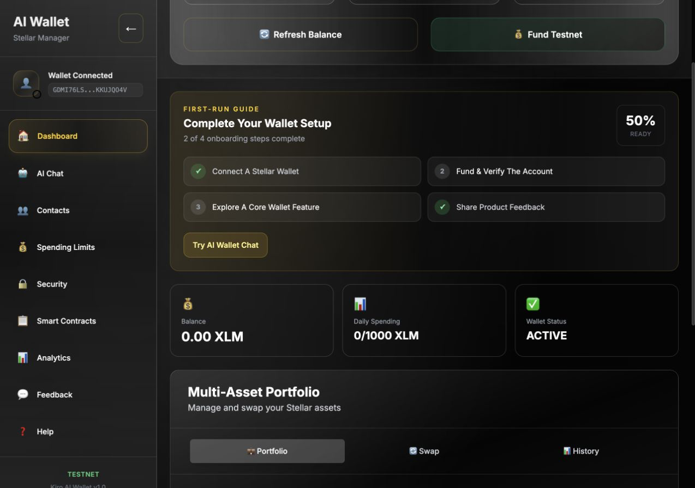
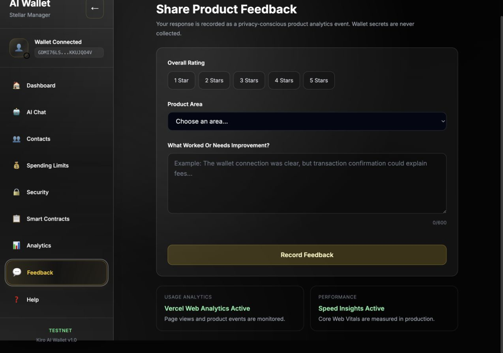

# 🤖 AI Wallet Manager — Stellar Blockchain

> **Rise In — Stellar Journey to Mastery | Level 5 Growth & Product Iteration Submission**


An AI-powered wallet management application built on the **Stellar blockchain**, enabling users to manage multi-asset portfolios, execute token swaps, set smart contract spending limits, and interact with their wallet using natural language commands.

---

> [!NOTE]
> ### 🚀 ADVANCED UPGRADE: Interactive Charts & AI Safety Guardrails
> We have added next-level visual analytics and visual guardrail audits to provide a premium wallet experience:
> 
> *   **Interactive SVG Donut Chart:** A custom, low-latency, responsive SVG asset allocation chart. Hovering over slices dynamically displays real-time balances, assets value in XLM, and USD equivalents inside the center of the ring.
> *   **Concentric Limit Progress Rings:** Side-by-side circular indicators visualizing the utilization percentage of your smart-contract daily and monthly limits with glowing thresholds.
> *   **Activity Flow Line Graph:** A custom SVG area chart mapping your last 10 transactions with interactive hovered points showing XLM transaction volume trends.
> *   **AI-Driven Safety Guardrail Cards:** Rich security confirmation panels directly inside the AI Chat window checking destination address contacts trust, transaction exposure risks, limit caps, and wallet freeze locks, coupled with Gemini-powered ELI5 (Explain Like I'm 5) details.

---

## 🌐 Live Demo

**[https://omyaingle.vercel.app](https://omyaingle.vercel.app)**

The production deployment is online with Vercel Web Analytics, Speed Insights,
guided onboarding, an in-product feedback flow, and real-ledger activity proof.

## Level 5 Submission Hub

| Requirement | Evidence |
|---|---|
| Public repository | [Om12345-ingle/ai-wallet-manager](https://github.com/Om12345-ingle/ai-wallet-manager) |
| Live application | [omyaingle.vercel.app](https://omyaingle.vercel.app) |
| Professional pitch deck | [Download the Level 5 PPT](docs/AI-Wallet-Manager-Level-5-Pitch.pptx) |
| User feedback workbook | [Download the Excel workbook](docs/level-5-user-feedback.xlsx) |
| Growth and iteration plan | [Level 5 growth plan](docs/LEVEL5_GROWTH_PLAN.md) |
| Analytics screenshot | [Monitoring evidence](docs/screenshots/05-feedback-monitoring.png) |
| Transaction activity | [Activity Proof screenshot](docs/screenshots/07-level5-activity-proof.png), in-app explorer links, and [interaction CSV template](docs/user-wallet-interactions.csv) |
| Demo video | Pending the real 50-wallet study and final recording; [recording script](docs/DEMO_SCRIPT.md) |

The Google Forms step was intentionally skipped at the project owner's request.
The Excel workbook is ready for manual entry/import of consented responses and
contains formula-driven analysis. No response or wallet interaction is fabricated.

## Level 5 Product Improvements

The release turns reviewer feedback about onboarding clarity and evidence into
two shipped improvements:

- **Watch-only onboarding:** reviewers can inspect a wallet with only its public
  address; signing remains restricted to Freighter or explicit testnet credentials.
- **Activity Proof workspace:** live Horizon data is measured against the
  50-interaction goal and the 2–3 minute interval rule, with Stellar Expert links
  and judge-ready CSV export.

The exact implementation commit link will be added here immediately after the
owner-authored release commit is created.

## Product Evidence

| Desktop onboarding | Mobile onboarding |
|---|---|
|  |  |

| Responsive dashboard | Monitoring and feedback |
|---|---|
|  |  |

Additional evidence:

- [Mobile connected dashboard](docs/screenshots/03-mobile-dashboard.png)
- [Verified feedback receipt](docs/screenshots/06-feedback-receipt.png)
- [Level 5 on-chain Activity Proof](docs/screenshots/07-level5-activity-proof.png)
- [Production readiness matrix](docs/PRODUCTION_READINESS.md)
- [Consent-based wallet interaction template](docs/user-wallet-interactions.csv)
- [Live demo recording script](docs/DEMO_SCRIPT.md)

---
google docs link - https://docs.google.com/spreadsheets/d/1Fy0MHt8JeNQrlyHyKJqUPEF3bupMbKvlBDsOAh3Yy44/edit?usp=sharing
## 📋 Reviewer Feedback & Fixes

> 📊 [Full Review Sheet](https://docs.google.com/spreadsheets/d/1Fy0MHt8JeNQrlyHyKJqUPEF3bupMbKvlBDsOAh3Yy44/edit?usp=sharing)

| # | Feedback | Fix Applied | Commit |
|---|---|---|---|
| 1 | AI chatbot doesn't understand natural language — even correct prompts fail | Upgraded to **Gemini 1.5 Flash** AI with regex fast-path + Gemini fallback for anything unrecognized | `feat: upgrade AI parser to Gemini 1.5 Flash` |
| 2 | Chat should have its own separate page | Added dedicated **AI Chat** tab in sidebar with full-page chat interface | `feat: chat as dedicated page` |
| 3 | Topbar/navbar stuck on all pages — should only be on one page | Header now only shows on Dashboard. Other pages have a clean minimal top bar. Navbar removed from non-dashboard views | `fix: navbar only on dashboard` |
| 4 | Mobile view broken — had to switch to desktop site | Added **mobile bottom navigation bar**, slide-out hamburger menu, proper viewport meta tag, responsive padding | `fix: full mobile responsive layout` |
| 5 | No contact list — can't save contacts or send to them easily | Added full **Contacts page** with add/remove/send functionality. Send XLM directly from contact card | `feat: contacts page with send` |
| 6 | Sending money to a friend not intuitive | Contacts page has one-click **Send XLM** button per contact. AI chat also supports "Send 10 XLM to Alice" | `feat: contacts page with send` |

---

## ✅ Tests — 54 Passing

```
 PASS  __tests__/command-parser.test.ts
 PASS  __tests__/stellar-utils.test.ts
 PASS  __tests__/wallet-api.test.ts

Test Suites: 3 passed, 3 total
Tests:       54 passed, 54 total
Snapshots:   0 total
Time:        5.8 s
```

Run tests locally:
```bash
npm test
```

---

## 🔗 Verified On-Chain Deployment

The repository contains two real Soroban contracts deployed on Stellar
testnet. The deployment record and all confirmed transaction hashes are
versioned in [`deployments/testnet.json`](deployments/testnet.json), with an
upload-ready [`testnet traction CSV`](deployments/testnet-traction.csv).

| Submission field | Verified value |
|---|---|
| Project Name | AI Wallet Manager |
| GitHub Repo | https://github.com/Om12345-ingle/ai-wallet-manager |
| Mainnet Transactions | 0 — awaiting a funded mainnet deployment signer |
| Mainnet Contract Address | Not deployed yet |
| Testnet Traction | 9 confirmed deployment/configuration transactions |
| Testnet Wallet Guard | [`CBLWIUQGJU24KFXGYT62FO7ELDYUE3QTDB2OOYPRNTHPJC4KVNSFG7DQ`](https://stellar.expert/explorer/testnet/contract/CBLWIUQGJU24KFXGYT62FO7ELDYUE3QTDB2OOYPRNTHPJC4KVNSFG7DQ) |
| Testnet Multi Asset Manager | [`CAVYUCHMTSTCRMBKHLWPNBK73BWMTSBU3CDE3EMVDSRNKXCC632P4CXD`](https://stellar.expert/explorer/testnet/contract/CAVYUCHMTSTCRMBKHLWPNBK73BWMTSBU3CDE3EMVDSRNKXCC632P4CXD) |

Key proof transactions:

- [Wallet Guard deployment](https://stellar.expert/explorer/testnet/tx/7ef4826b57a38c59e4635f2fc7d0276b9566704382670e69adaff083104de211)
- [Multi Asset Manager deployment](https://stellar.expert/explorer/testnet/tx/35a4d1f8c2cc60ebf1a333ddc242452167095d581b80b5f95f47ae287e67e5bc)
- [Wallet Guard initialization](https://stellar.expert/explorer/testnet/tx/165958094f3d940093489e3f05167e2d51b7ad88793695eb72c92303d8e09d29)
- [Multi Asset Manager initialization](https://stellar.expert/explorer/testnet/tx/a53ceedb62a1eac9abfdb230ab22307079e0aaab6ca53ac63c21278a89b29368)

Copy-ready judge submission data is available in [`SUBMISSION.md`](SUBMISSION.md).

**Supported Assets & Issuers:**

| Asset | Issuer |
|---|---|
| XLM | Native |
| USDC | `GBBD47IF6LWK7P7MDEVSCWR7DPUWV3NY3DTQEVFL4NAT4AQH3ZLLFLA5` |
| EURC | `GDHU6WRG4IEQXM5NZ4BMPKOXHW76MZM4Y2IEMFDVXBSDP6SJY4ITNPP2` |
| AQUA | `GBNZILSTVQZ4R7IKQDGHYGY2QXL5QOFJYQMXPKWRRM5PAV7Y4M67AQUA` |
| YBX | `GBUYUAI75XXWDZEKLY66CFYKQPET5JR4EENXZBUZ3YXZ7DS56Z4OKOFU` |

---

## 📋 Table of Contents

- [Overview](#overview)
- [Level 4 Requirements Met](#level-4-requirements-met)
- [Features](#features)
- [Tech Stack](#tech-stack)
- [Architecture](#architecture)
- [Smart Contracts](#smart-contracts)
- [CI/CD Pipeline](#cicd-pipeline)
- [Getting Started](#getting-started)
- [Environment Variables](#environment-variables)
- [API Reference](#api-reference)

---

## Overview

AI Wallet Manager is a production-ready dApp on the **Stellar Testnet** that combines natural language AI with blockchain wallet operations. Users connect their Stellar wallet (manually or via Freighter), then interact through a chat interface to check balances, send assets, swap tokens, and manage security — all without needing to understand blockchain mechanics.

---

## ✅ Level 4 Requirements Met

| Requirement | Status | Details |
|---|---|---|
| Advanced smart contracts | ✅ | Deployed Soroban spending limits, wallet freeze, contacts, and multi-asset management |
| Production-ready app | ✅ | Existing Vercel deployment plus a locally verified release ready to publish |
| Multi-asset support | ✅ | XLM, USDC, EURC, AQUA, YBX |
| Token swapping | ✅ | Path payment via Stellar DEX |
| Trustline management | ✅ | Auto-detect and create trustlines |
| Real on-chain transactions | ✅ | 9 verified contract deployment/configuration transactions on Stellar testnet |
| CI/CD pipeline | ✅ | GitHub Actions tests/builds; credential-gated Stellar and Vercel deployments |
| Clean architecture | ✅ | Next.js App Router, typed APIs, context state |
| README documentation | ✅ | This document |

---

## ✨ Features

### 🤖 AI-Powered Chat (Gemini 1.5 Flash)
- Powered by Google Gemini AI — understands natural, conversational language
- Fast regex pre-parser for instant common commands
- Gemini fallback for anything complex or ambiguous
- Commands like `"I want to swap some XLM for dollars"`, `"how much do I have?"`, `"lock my wallet down"`

### 💼 Multi-Asset Portfolio
- Real-time balances for XLM, USDC, EURC, AQUA, YBX
- Portfolio value in XLM and USD equivalent

### 🔄 Token Swapping
- Swap between any supported Stellar assets
- Automatic trustline creation for new assets

### 👥 Contacts
- Save Stellar addresses with names
- Send XLM directly from contact card with one click
- AI chat supports "Send 10 XLM to Alice"

### 🔒 Smart Contract Security
- Daily and monthly spending limits
- Emergency wallet freeze / unfreeze
- Contact management (local + on-chain)

### 📱 Mobile-First Design
- Bottom navigation bar on mobile
- Slide-out hamburger menu
- Responsive layout at all screen sizes

---

## 🛠 Tech Stack

| Layer | Technology |
|---|---|
| Frontend | Next.js 15.5, React 19, TypeScript |
| Styling | Tailwind CSS |
| Blockchain | Stellar SDK, Soroban Smart Contracts |
| AI | Google Gemini 1.5 Flash + regex fast-path |
| Wallet | Freighter API |
| Network | Stellar Testnet |
| Deployment | Vercel |
| CI/CD | GitHub Actions |

---

## 🏗 Architecture

```
┌─────────────────────────────────────────────┐
│                  Next.js App                │
│                                             │
│  ┌──────────┐ ┌──────────┐ ┌─────────────┐ │
│  │ Dashboard│ │ AI Chat  │ │  Contacts   │ │
│  └────┬─────┘ └────┬─────┘ └──────┬──────┘ │
│       └────────────┴──────────────┘         │
│                    │                        │
│  ┌─────────────────▼──────────────────────┐ │
│  │           App Context (State)          │ │
│  └─────────────────┬──────────────────────┘ │
│                    │                        │
│  ┌─────────────────▼──────────────────────┐ │
│  │  API Routes                            │ │
│  │  /api/ai-parse  (Gemini + regex)       │ │
│  │  /api/stellar/balance                  │ │
│  │  /api/stellar/send                     │ │
│  │  /api/stellar/multi-asset              │ │
│  │  /api/stellar/smart-limit              │ │
│  └─────────────────┬──────────────────────┘ │
└───────────────────┬─────────────────────────┘
                    │
        ┌───────────▼────────────┐
        │   Stellar Testnet      │
        │   Horizon + Soroban    │
        └────────────────────────┘
```

---

## 🔄 CI/CD Pipeline

Every push to `main` triggers the GitHub Actions pipeline:

```
Push to main
     │
     ▼
┌─────────────────────┐
│  1. Checkout code   │
│  2. Install deps    │
│  3. TypeScript check│
│  4. Run 54 tests    │
│  5. Production build│
└──────────┬──────────┘
           │ (on success)
           ▼
┌─────────────────────┐
│ Deploy to Vercel if │
│ token is configured │
└─────────────────────┘
```

```yaml
name: CI/CD Pipeline
on:
  push:
    branches: [main]
  pull_request:
    branches: [main]
jobs:
  build-and-test:
    runs-on: ubuntu-latest
    steps:
      - uses: actions/checkout@v6
      - uses: actions/setup-node@v6
        with: { node-version: '20', cache: 'npm' }
      - run: npm ci --legacy-peer-deps
      - run: npx tsc --noEmit
      - run: npm test
      - run: npm run build
  deploy:
    needs: build-and-test
    runs-on: ubuntu-latest
    if: github.ref == 'refs/heads/main'
    steps:
      - uses: actions/checkout@v6
      - run: npx vercel@latest deploy --prod --token="$VERCEL_TOKEN" --yes
```

The Soroban workflow also runs Rust formatting, seven contract tests, and both
WASM builds. Contract deployment is manual and signer-gated so CI never embeds
private keys.

---

## 🚀 Getting Started

```bash
git clone https://github.com/Om12345-ingle/ai-wallet-manager.git
cd ai-wallet-manager
npm install
cp .env.example .env.local
# Add your keys to .env.local
npm run dev
```

Open [http://localhost:3000](http://localhost:3000)

---

## 🔑 Environment Variables

```env
STELLAR_PUBLIC_KEY=G...
STELLAR_SECRET_KEY=S...
GEMINI_API_KEY=...           # Google Gemini AI (strongly recommended)
NEXT_PUBLIC_STELLAR_NETWORK=testnet
NEXT_PUBLIC_CONTRACT_ID=CBLWIUQGJU24KFXGYT62FO7ELDYUE3QTDB2OOYPRNTHPJC4KVNSFG7DQ
NEXT_PUBLIC_MULTI_ASSET_CONTRACT_ID=CAVYUCHMTSTCRMBKHLWPNBK73BWMTSBU3CDE3EMVDSRNKXCC632P4CXD
```

---

## 📡 API Reference

| Endpoint | Method | Description |
|---|---|---|
| `/api/ai-parse` | POST | Parse natural language (Gemini + regex) |
| `/api/stellar/balance` | POST | Get XLM balance |
| `/api/stellar/send` | POST | Send XLM or assets |
| `/api/stellar/history` | POST | Transaction history |
| `/api/stellar/multi-asset` | POST | Portfolio, swap, prices, trustlines |
| `/api/stellar/smart-limit` | POST | Spending limits, freeze, contacts |
| `/api/stellar/fund-testnet` | POST | Fund via Friendbot |

---

## 💬 Supported Chat Commands

```
"What's my balance?"          → balance check
"Show my portfolio"           → all assets
"Swap 100 XLM to USDC"        → token swap
"Send 10 XLM to Alice"        → send to contact
"Send 5 XLM to G..."          → send to address
"Freeze my wallet"            → emergency lock
"Set daily limit to 500 XLM"  → spending limit
"List contacts"               → show contacts
"What are current prices?"    → asset prices
"Transaction history"         → recent txs
"Help"                        → command list
```

---

## 🗺 Roadmap

- [x] Level 1 — Wallet creation + on-chain transactions
- [x] Level 2 — Multi-wallet flows + smart contract integration
- [x] Level 3 — Complete mini dApp with swap and portfolio
- [x] Level 4 — Advanced smart contracts + production + CI/CD + reviewer fixes
- [ ] Level 5 — Complete the genuine 50-wallet validation study and publish the demo video
- [ ] Level 6 — Retention cohorts, ecosystem partnerships and mainnet readiness

---

## 📄 License

MIT

---

## 🙏 Built With

[Stellar](https://stellar.org) · [Rise In](https://risein.com) · [Next.js](https://nextjs.org) · [Vercel](https://vercel.com) · [Google Gemini](https://ai.google.dev)
